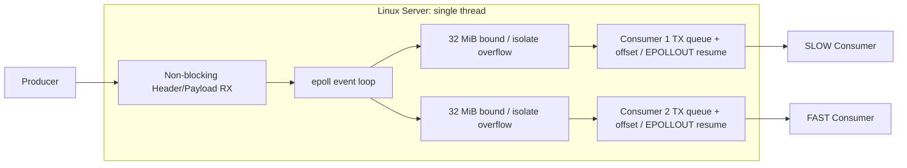
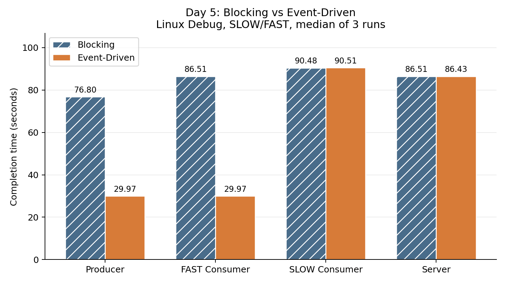
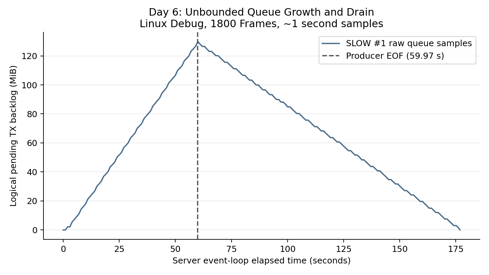
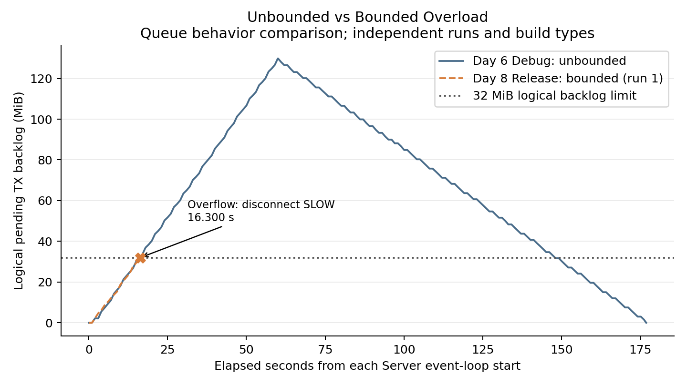

[English](README.md) | [한국어](README.ko.md)

# EventStreamLab

## 1. 프로젝트 개요

Slow Consumer 격리, non-blocking I/O, epoll, partial write, application-level TX queue와 bounded overload 처리를 실험하는 C++20/Linux event-driven TCP stream server입니다.

**하나의 느린 Consumer가 다른 Consumer와 Producer까지 지연시키는 것을 어떻게 방지할 수 있는가?**

### 핵심 요약

순차 Blocking fan-out에서는 SLOW 때문에 FAST와 Producer까지 늦어졌습니다. Non-blocking I/O와 epoll로 연결별 대기를 분리했지만, 지속적인 처리 속도 차이는 unbounded TX queue에 쌓였습니다. 최종 Server는 Consumer별 logical unsent backlog를 **32 MiB (33,554,432 bytes)**로 제한하고, 다음 Frame을 넣으면 한도를 넘는 연결만 disconnect합니다.

Release 검증은 **7/7 run 통과**입니다. 정상 Consumer에서는 정책이 발동하지 않았고, 한도 안의 SLOW는 모든 Frame을 drain했습니다. Overload에서는 SLOW만 격리하고 Producer/FAST는 전체 1800 Frames를 완료했습니다. 측정을 통해 설계를 검증하는 학습 프로젝트이며, production-ready server를 주장하지 않습니다.

## 2. 문제 정의

Blocking baseline은 Producer Frame을 받은 뒤 accept 순서대로 Consumer마다 `sendAll()`을 호출합니다. Slow Consumer가 입력 속도를 따라가지 못하면 TCP buffer/window pressure로 send 호출이 오래 대기할 수 있습니다. 이후 Consumer 송신과 다음 Producer 수신도 기다리므로 **SLOW → Server → 뒤의 FAST → Producer**로 지연이 전파됩니다.

목표는 하나의 Server thread에서 연결별 대기를 격리하고, Consumer 처리 용량이 계속 부족할 때 적용할 overload 정책을 명시하는 것입니다.

## 3. 아키텍처



Producer는 전용 port를 사용하고 Consumer들은 다른 listener로 연결합니다. Connection setup은 blocking socket으로 Producer를 먼저 accept한 뒤 설정한 Consumer 수만큼 accept합니다. Linux data path는 accepted socket을 non-blocking으로 바꾸어 하나의 epoll loop에서 처리하고, 다른 플랫폼은 Blocking Server 경로를 유지합니다. Connection 번호는 Consumer `--id`가 아니라 accept 순서입니다.

## 4. 구조 개선 과정

1. **Blocking baseline:** 순차 `sendAll()`에서 Head-of-Line Blocking과 upstream backpressure를 재현했습니다.
2. **Non-blocking + epoll:** `send()`는 양수의 partial progress, `EAGAIN/EWOULDBLOCK`, fatal error를 반환할 수 있습니다. Offset을 저장하고 readiness가 오면 재개합니다.
3. **독립 TX state:** Consumer별 `pending_frames`, `front_offset`, `pending_bytes`, writable interest를 관리합니다. SLOW의 EAGAIN이 다른 ready FD를 멈추지 않습니다.
4. **새 병목:** 대기는 격리됐지만 지속적인 처리 속도 차이가 application queue 증가로 옮겨갔습니다. Day 6에서는 workload가 길수록 peak가 커졌습니다.
5. **Bounded 정책:** enqueue 전에 현재 pending bytes와 incoming wire Frame 크기의 합이 32 MiB를 넘는지 확인합니다. 초과한 Consumer만 닫고 queue reference를 해제한 뒤, 같은 Frame을 다른 Consumer에게 계속 전달합니다. 이후 Frame에서는 invalid socket을 건너뜁니다.

## 5. 핵심 구현

**Partial I/O 상태.** Blocking helper는 call stack 안에서 진행 상태를 유지합니다. Event handler는 EAGAIN에서 반환하므로 현재 Frame, offset, queue를 명시적으로 보존해야 합니다. Producer RX도 EPOLLIN 사이에 partial Header/Payload offset을 유지합니다. 기존 `sendAll()`과 exact-receive helper의 Blocking semantics는 그대로입니다.

**Readiness는 재시도할 수 있다는 알림입니다.** EPOLLOUT이 pending Frame 전체를 보낼 수 있다고 보장하지는 않습니다. `buffer.data() + offset`부터 재개하고 성공한 send byte 수만큼만 전진하며, 다시 EAGAIN이 나오면 상태를 유지합니다. Pending TX가 진행할 수 없을 때 EPOLLOUT을 켜고 queue가 비면 꺼서 idle Level Triggered writable wakeup을 피합니다. Clean Producer EOF 이후에도 살아 있는 queue는 drain한 뒤 정상 종료합니다.

**Storage 공유와 독립 진행 상태.** Consumer queue들은 하나의 immutable `std::shared_ptr<const std::vector<std::uint8_t>>` wire Frame을 공유합니다. Queue와 offset은 Consumer마다 독립적입니다. Disconnect는 해당 queue의 reference만 제거하므로 다른 Consumer가 사용하는 Frame은 유지되고, 마지막 reference가 사라지면 해제될 수 있습니다. Logical backlog bound는 **process RSS 제한이 아니며**, RSS가 즉시 같은 크기만큼 감소한다는 보장도 아닙니다.

**Wire protocol과 workload.** 명시적 직렬화로 34-byte Big Endian header를 사용합니다. 필드는 `magic`, `version`, `stream_id`, `sequence`, `timestamp_ns`, `payload_size`, `flags`입니다. Padding, ABI, endian 의존성을 피하기 위해 raw struct memory를 보내지 않습니다. Normal payload는 100 KiB, 매 30번째 Frame은 500 KiB이며 deterministic byte pattern을 사용합니다. Benchmark Producer는 30 FPS로 전송합니다.

## 6. 측정 방법

Day 5–8은 모두 Linux/WSL2 loopback에서 Producer 하나를 사용했습니다. FAST/FAST를 제외하면 SLOW connection #1은 Frame당 100 ms delay, #2는 FAST입니다. Runner는 연결 순서를 확인하고 실제 process를 실행하며, asyncio watcher가 각 종료 시각을 독립적으로 기록합니다. Primary 시간은 Producer launch 직전부터 측정하고 내부 `elapsed_ms`는 보조 지표입니다. Queue/event 시간은 각 Server event loop 시작 기준입니다.

Day 5는 Debug SLOW/FAST를 architecture별 3회 교차 실행했고(900 Frames), FAST/FAST control은 각각 1회였습니다. Day 6은 Debug에서 300/900/1800 Frames를 각각 1회 관찰했습니다. Day 7은 bounded Debug 정책과 control을 검증했습니다. Day 8은 정상/overload Release pair를 3회 교차 실행한 뒤(1800 Frames), under-limit을 1회 실행했습니다(300 Frames).

Correctness는 Frame 수, payload/sequence 검증, queue invariant, process outcome으로 판정합니다. 성능에는 pass threshold를 두지 않습니다. Overload SLOW가 partial Frame에서 exit 1할 수 있지만, Server overflow event/metric으로 확인된 transport EOF/reset만 인정합니다. Protocol mismatch와 crash는 실패입니다. Blocking `sendAll()` 시간은 대기를 포함하고 event active-send 시간은 EPOLLOUT 대기를 제외하므로, 두 값을 직접 speedup 계산에 사용하지 않습니다.

## 7. 결과

| 실험 | Producer (s) | FAST (s) | SLOW / queue | 결과 |
| --- | ---: | ---: | --- | --- |
| Day 5 Blocking Debug, 900 Frames (median) | 76.801 | 86.512 | SLOW 90.482 s | 전체 Frame; 지연 전파 |
| Day 5 Event Debug, 900 Frames (median) | 29.971 | 29.975 | SLOW 90.506 s | 전체 Frame; 지연 격리 |
| Day 6 unbounded Debug, 1800 Frames | 59.973 | 59.980 | Peak 136,110,018 bytes | Backlog 증가 후 drain |
| Day 8 bounded Release overload, 1800 Frames (median) | 59.970 | 59.971 | 관찰된 최대 peak 33,544,838 bytes | SLOW disconnect; FAST 완료 |

이 표는 speedup 순위가 아닙니다. **Day 5는 architecture 비교, Day 6은 unbounded backlog 관찰, Day 8은 최종 Release 정책 검증**입니다. Day 8은 overload 시 delivery semantics도 의도적으로 바뀌었습니다.

### Day 5: 지연 격리



Event-driven 구조는 Slow Consumer 자체를 빠르게 만든 것이 아니라, Slow의 지연이 Producer와 FAST Consumer로 전파되는 것을 격리했습니다. 그래프는 Linux Debug에서 architecture별 SLOW/FAST 3회 completion median입니다.

| Completion median (s) | Blocking | Event-Driven |
| --- | ---: | ---: |
| Producer | 76.801 | 29.971 |
| FAST | 86.512 | 29.975 |
| SLOW | 90.482 | 90.506 |
| Server | 86.511 | 86.432 |

Kernel socket buffering 때문에 Server send 완료와 Slow application 수신 완료는 다를 수 있습니다. Server가 먼저 끝나는 것은 오류가 아닙니다. [Day 5 상세 결과](benchmarks/results/day5-debug/summary.md)에는 임시 raw/log 유실 후 기록된 console output에서 summary를 복원했다는 사실도 명시돼 있습니다.

### Day 6: queue 증가



SLOW #1의 raw sample은 Producer 입력 중 증가하고 첫 `producer_finished=1` sample 이후 감소합니다. 약 1초 sampling은 순간 peak를 놓칠 수 있으므로 아래 표는 enqueue마다 갱신한 Server counter를 사용합니다.

| Frames | Exact peak Frames | Exact peak bytes | Exact peak MiB |
| --- | ---: | ---: | ---: |
| 300 | 125 | 14,754,072 | 14.07 |
| 900 | 570 | 66,139,338 | 63.08 |
| 1800 | 1,171 | 136,110,018 | 129.80 |

Event-driven 처리가 capacity mismatch를 없애지는 않았습니다. 병목의 압력이 Blocking send 대기에서 application backlog로 이동했습니다. MiB는 bytes / 1024² 기준입니다. [Day 6 상세 결과](benchmarks/results/day6-debug/summary.md).

### Day 8: 최종 Release 정책 검증



Day 6 Debug unbounded sample과 Day 8 Release overload run1 sample은 서로 다른 Server event loop 시작 시각과 build type을 사용합니다. **Queue behavior 비교**이며 동기화된 시간 비교나 새로운 Blocking speedup 비교가 아닙니다. 32 MiB 선은 logical limit, marker는 실제 overflow event입니다. Bounded 선은 disconnect에서 끝나며 이후 backlog 0으로 서비스를 계속했다는 뜻이 아닙니다.

| Release 시나리오 | Runs | Producer (s) | Consumer #1 (s) | FAST #2 (s) | 결과 |
| --- | ---: | ---: | ---: | ---: | --- |
| FAST/FAST, 1800 Frames (median) | 3 | 59.971 | 59.972 | 59.972 | 전체 Frame; overflow 0 |
| SLOW/FAST under-limit, 300 Frames | 1 | 9.970 | 30.054 | 9.971 | 전체 Frame; overflow 0 |
| SLOW/FAST overload, 1800 Frames (median) | 3 | 59.970 | 정책 종료 | 59.971 | Producer/FAST 완료; SLOW 격리 |

Under-limit SLOW exact peak는 **19,496,592 bytes (18.59 MiB)**였고, 전체 300 Frames를 전달한 뒤 queue가 zero까지 drain됐습니다. Overload 3회는 모두 통과했고 FAST overflow는 0입니다. 관찰된 SLOW exact peak 최대값은 **33,544,838 bytes ≤ 33,554,432 bytes**였습니다. 정상 FAST exact peak는 1 Frame / 512,034 bytes입니다. [Day 7 정책 검증](benchmarks/results/day7-debug/summary.md), [Day 8 Release 상세 결과](benchmarks/results/day8-release/summary.md)를 참고하세요.

## 8. Backpressure 정책과 Trade-off

| 정책 | 장점 | 비용 |
| --- | --- | --- |
| Upstream backpressure | Lossless 전달에 적합할 수 있음 | SLOW가 전체 latency에 영향 |
| DROP_NEWEST | 기존 backlog/order 유지 | 최신 정보 손실 |
| DROP_OLDEST | 최신 상태 유지에 유리 | Sequence gap / lossy semantics 필요 |
| Disconnect | Overloaded connection 격리 | SLOW stream continuity 포기 |

현재는 **한도를 초과한 Consumer만 disconnect**합니다. 연결 격리라는 목표에 맞춘 선택이며 보편적인 최선의 정책은 아닙니다. 즉시 닫으면 partial Frame을 끊을 수 있어 receiver가 transport EOF를 오류로 보고할 수 있습니다. 명시적 overload 처리이며, SLOW 전체 stream 전달 성공을 뜻하지 않습니다.

## 9. 빌드 및 테스트

Linux 준비 사항은 CMake ≥ 3.20, C++20 compiler, runner용 Python 3, 그래프용 matplotlib입니다. 측정 runner는 그 외 외부 Python dependency 없이 standard library를 사용합니다.

```bash
# Debug
cmake -S . -B out/linux-debug -DCMAKE_BUILD_TYPE=Debug
cmake --build out/linux-debug -j
ctest --test-dir out/linux-debug --output-on-failure

# Release
cmake -S . -B out/release -DCMAKE_BUILD_TYPE=Release
cmake --build out/release -j
ctest --test-dir out/release --output-on-failure
```

5개 CTest target은 protocol, clock, workload, CLI, socket I/O를 검증합니다. 기록된 Day 8 Release 결과는 **5/5 통과**이며 GCC 13.3.0, CMake 3.28.3, 실제 `CMAKE_CXX_FLAGS_RELEASE=-O3 -DNDEBUG`였습니다. 다른 환경의 compiler/CMake default는 다를 수 있습니다.

아래 순서대로 별도 terminal에서 실행합니다. SLOW의 `Connected to server`를 확인한 뒤 FAST를 시작하고, FAST 연결 확인 뒤 Producer를 시작합니다. 9000/9001이 사용 중이면 빈 port를 선택하세요. 900-Frame SLOW 예시는 정책을 발동시킬 수 있으며, 짧은 stream은 `--frames 300`으로 실행할 수 있습니다.

```bash
# Terminal 1: Server
./out/linux-debug/esl_server --producer-port 9000 --consumer-port 9001 --expected-consumers 2

# Terminal 2: SLOW #1
./out/linux-debug/esl_consumer --host 127.0.0.1 --port 9001 --mode slow --delay-ms 100 --id 10

# Terminal 3: FAST #2
./out/linux-debug/esl_consumer --host 127.0.0.1 --port 9001 --mode fast --id 1

# Terminal 4: Producer
./out/linux-debug/esl_producer --host 127.0.0.1 --port 9000 --fps 30 --frames 900
```

## 10. 벤치마크 재현

Historical 동작은 당시 source tree로 재현해야 합니다. 현재 bounded main으로 Day 5/6 unbounded semantics를 재현할 수 없습니다. Repository root에서 비어 있는 sibling 경로를 사용하고 tracked source를 clean하게 유지하세요. 기존 worktree는 덮어쓰지 않습니다. Day 8은 clean `main` checkout을 요구하므로 detached worktree 대신 현재 최종 application source에서 실행합니다.

```bash
git worktree add --detach ../esl-blocking blocking-baseline-v0.1
git worktree add --detach ../esl-day5 224d88c
git worktree add --detach ../esl-day6 f508c5a
git worktree add --detach ../esl-day7 adcc3b7

# Historical Debug builds
for study_tree in ../esl-blocking ../esl-day5; do
  cmake -S "$study_tree" -B "$study_tree/out/day5-debug" -DCMAKE_BUILD_TYPE=Debug
  cmake --build "$study_tree/out/day5-debug" -j
done
for study_day in 6 7; do
  study_tree="../esl-day${study_day}"
  cmake -S "$study_tree" -B "$study_tree/out/day${study_day}-debug" -DCMAKE_BUILD_TYPE=Debug
  cmake --build "$study_tree/out/day${study_day}-debug" -j
done
cmake -S . -B out/day8-release -DCMAKE_BUILD_TYPE=Release
cmake --build out/day8-release -j
```

| Runner | 목적 | 필요한 build directory |
| --- | --- | --- |
| Day 5 | Blocking vs Event architecture 비교 | 두 tree: `out/day5-debug` |
| Day 6 | Unbounded queue growth 관찰 | Historical Day 6: `out/day6-debug` |
| Day 7 | Bounded overload policy 검증 | Historical Day 7: `out/day7-debug` |
| Day 8 | 최종 Release 검증 | Clean main: `out/day8-release` |

아래 명령은 수분 걸리는 실험을 실행합니다. 사용하지 않은 output 경로를 선택하세요. Runner는 기존 output/artifact를 덮어쓰지 않습니다. 결과를 읽는 데 필요한 명령이 아니라 재현용 안내입니다.

```bash
python3 benchmarks/day5_compare.py --event-tree ../esl-day5 --blocking-tree ../esl-blocking --out /tmp/esl-day5-reproduction
python3 benchmarks/day6_queue_growth.py --event-tree ../esl-day6 --out /tmp/esl-day6-reproduction
python3 benchmarks/day7_bounded_queue.py --event-tree ../esl-day7 --out /tmp/esl-day7-reproduction
python3 benchmarks/day8_release_benchmark.py --event-tree . --out /tmp/esl-day8-reproduction
```

그래프 생성에는 benchmark 실행이 필요 없습니다. `plot_results.py`는 commit된 CSV를 읽어 계산값을 출력하고 세 PNG만 다시 생성합니다. Matplotlib이 필요합니다.

```bash
python3 benchmarks/plot_results.py
# Optional alternate destination
python3 benchmarks/plot_results.py --output-dir /tmp/esl-plots
```

## 11. 프로젝트 구조

```text
include/eventstream/     # Protocol, socket, CLI, workload interfaces
src/common/             # Shared implementations
src/producer/           # Synthetic paced Producer
src/server/             # Linux epoll data path / blocking fallback
src/consumer/           # FAST and SLOW validation clients
tests/                  # Five CTest targets
benchmarks/             # Measurement runners and plot_results.py
benchmarks/results/     # Committed summaries, events and queue samples
docs/images/            # CSV-derived graphs
```

## 12. 한계

- Linux/WSL loopback, synthetic data, Producer 하나와 Consumer 둘을 사용했으며 production network hardware 실험이 아닙니다.
- 즉시 overflow disconnect는 SLOW의 Frame 중간을 끊을 수 있고, overloaded Consumer의 stream continuity를 보장하지 않습니다.
- Queue sample 간격은 약 1초이며 logging overhead가 있고 순간 최대값을 놓칠 수 있습니다.
- 32 MiB logical backlog limit으로 process RSS를 측정하거나 제한하지 않았습니다. Shared storage, allocator, kernel buffer는 별개입니다.
- Event-driven data path의 초점은 connection setup이 아닙니다. Blocking setup과 non-Linux fallback은 남아 있습니다.
- Completion 값은 관찰 결과이며 보편적인 throughput 주장으로 해석하지 않습니다.

## 13. 핵심 정리

- Blocking fan-out은 하나의 Slow Consumer 지연을 다른 연결로 전파할 수 있습니다.
- Non-blocking + epoll은 명시적인 partial-I/O state가 필요합니다.
- Event-driven 격리는 capacity mismatch를 없애지 않고 overload pressure를 queue로 옮깁니다.
- Queue 증가에는 명시적인 정책이 필요합니다.
- Bounded per-Consumer backlog와 disconnect-on-overflow로 지속 overload를 격리하면서 정상 Consumer는 계속 처리할 수 있었습니다.
