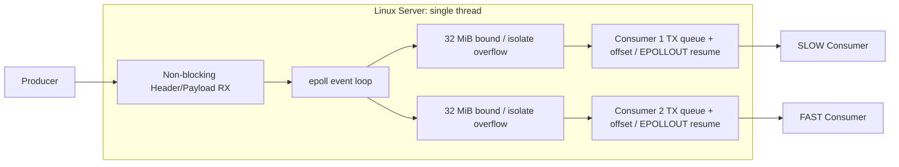

[English](README.md) | [한국어](README.ko.md)

# EventStreamLab

## 1. Project Overview

A C++20/Linux event-driven TCP stream server built to study Slow Consumer isolation, non-blocking I/O, epoll, partial writes, application-level TX queues, and bounded overload handling.

**How can a single Slow Consumer be prevented from delaying other Consumers and propagating backpressure to the Producer?**

### TL;DR

Sequential blocking fan-out delayed FAST and Producer behind SLOW. Non-blocking I/O with epoll isolated each connection's wait, but sustained rate mismatch accumulated in unbounded TX queues. The final Server caps each Consumer's logical unsent backlog at **32 MiB (33,554,432 bytes)** and disconnects only the connection that would exceed it.

Release validation passed **7/7 runs**: normal Consumers never triggered the policy, under-limit SLOW drained all Frames, and overload SLOW was isolated while Producer/FAST completed all 1800 Frames. This is a measured learning project, not a production-ready server claim.

## 2. Problem

The blocking baseline receives a Producer Frame and calls `sendAll()` for each Consumer in accept order. When a Slow Consumer stops keeping up, TCP buffer/window pressure can hold that send call. Later Consumer sends and the next Producer receive wait behind it: **SLOW → Server → later FAST → Producer**.

The goal is connection isolation on one Server thread, followed by an explicit overload policy when a Consumer's capacity remains below the input rate.

## 3. Architecture



The Producer uses a dedicated port; Consumers share another listener. Connection setup accepts the Producer first, then the configured Consumers using blocking sockets. The Linux data path switches accepted sockets to non-blocking and uses one epoll loop; other platforms retain the blocking Server path. Connection numbers reflect accept order, not Consumer `--id`.

## 4. Engineering Evolution

1. **Blocking baseline:** sequential `sendAll()` reproduced Head-of-Line Blocking and upstream backpressure.
2. **Non-blocking + epoll:** `send()` can report positive partial progress, `EAGAIN/EWOULDBLOCK`, or a fatal error. Save the offset and resume on readiness.
3. **Independent TX state:** each Consumer owns `pending_frames`, `front_offset`, `pending_bytes`, and writable interest. SLOW's EAGAIN does not stop other ready FDs.
4. **New bottleneck:** isolation moved sustained rate mismatch into application queue growth; longer Day 6 workloads produced larger peaks.
5. **Bounded policy:** before enqueue, test existing pending bytes plus incoming wire Frame size against 32 MiB. On overflow, close only that Consumer, release its queue references, continue the same Frame for other Consumers, and skip the invalidated socket on later Frames.

## 5. Key Implementation Details

**Partial I/O state.** Blocking helpers retain progress on the call stack. An event handler returns on EAGAIN, so it must retain the current Frame, offset, and queue explicitly. Producer RX likewise preserves partial Header/Payload offsets across EPOLLIN events. Existing `sendAll()` and exact-receive helpers keep their blocking semantics.

**Readiness is permission to retry.** EPOLLOUT does not promise that an entire pending Frame can be written. Resume at `buffer.data() + offset`, advance only by successful send bytes, and retain state if EAGAIN recurs. Enable EPOLLOUT when pending TX cannot progress; disable it when the queue drains to avoid idle Level Triggered writable wakeups. Clean Producer EOF ends input, but surviving queues drain before normal closure.

**Shared storage, independent progress.** Consumer queues share one immutable `std::shared_ptr<const std::vector<std::uint8_t>>` wire Frame. Each Consumer's queue/offset is independent. Disconnect clears only its references; a Frame remains alive while another Consumer uses it and can be released after the last reference disappears. The logical backlog bound is **not a process RSS cap**, nor a promise of an immediate RSS decrease.

**Wire protocol/workload.** Explicit serialization uses a 34-byte Big Endian header: `magic`, `version`, `stream_id`, `sequence`, `timestamp_ns`, `payload_size`, `flags`. Raw struct memory is not transmitted, avoiding padding, ABI, and endian dependencies. Normal payloads are 100 KiB; every 30th Frame is 500 KiB, with a deterministic byte pattern. Benchmarks pace the Producer at 30 FPS.

## 6. Benchmark Methodology

All reported Day 5–8 experiments used Linux/WSL2 loopback, one Producer, SLOW connection #1 at 100 ms per Frame, and FAST #2 unless both were FAST. Runners confirm connection order, launch actual processes, and use independent asyncio completion watchers. Primary time starts immediately before Producer launch; internal `elapsed_ms` is secondary. Queue/event timestamps start at each Server event-loop start.

Day 5 alternated Blocking/Event Debug SLOW/FAST three times per architecture (900 Frames), with one FAST/FAST control each. Day 6 ran 300/900/1800 Frames once each in Debug. Day 7 validated the bounded Debug policy and a control. Day 8 alternated three normal/overload Release pairs (1800 Frames), then one under-limit run (300 Frames).

Correctness checks Frame counts, payload/sequence validation, queue invariants, and process outcomes. Performance has no pass threshold. Overload SLOW may exit 1 mid-Frame; only transport EOF/reset corroborated by the Server overflow event/metrics is accepted. Protocol mismatches and crashes remain failures. Blocking `sendAll()` timing includes waiting; event active-send timing excludes EPOLLOUT wait and is not used for a direct speedup calculation.

## 7. Results

| Experiment | Producer (s) | FAST (s) | SLOW / queue | Outcome |
| --- | ---: | ---: | --- | --- |
| Day 5 Blocking Debug, 900 Frames (median) | 76.801 | 86.512 | SLOW 90.482 s | All Frames; propagated delay |
| Day 5 Event Debug, 900 Frames (median) | 29.971 | 29.975 | SLOW 90.506 s | All Frames; isolated delay |
| Day 6 unbounded Debug, 1800 Frames | 59.973 | 59.980 | Peak 136,110,018 bytes | Backlog growth, then drain |
| Day 8 bounded Release overload, 1800 Frames (median) | 59.970 | 59.971 | Max observed peak 33,544,838 bytes | SLOW disconnected; FAST completed |

These rows are not a speedup ranking: **Day 5 compares architectures; Day 6 observes unbounded backlog; Day 8 validates the final Release policy.** Day 8 deliberately changes overload delivery semantics.

### Day 5: delay isolation


Event-driven I/O did not make the Slow Consumer faster. It isolated the Slow Consumer's delay from the Producer and FAST Consumer. This chart shows Linux Debug completion medians from three SLOW/FAST runs per architecture.

| Completion median (s) | Blocking | Event-Driven |
| --- | ---: | ---: |
| Producer | 76.801 | 29.971 |
| FAST | 86.512 | 29.975 |
| SLOW | 90.482 | 90.506 |
| Server | 86.511 | 86.432 |

Server can complete sends before the Slow application finishes consumption: kernel socket buffering separates send completion from application receive completion. [Day 5 details](benchmarks/results/day5-debug/summary.md) also disclose recovery of the summary from recorded console output after original temporary raw/log loss.

### Day 6: queue growth


SLOW #1 raw samples grow during Producer input and drain after the first `producer_finished=1` sample. Sampling is about 1 second and can miss an instantaneous peak; the table uses Server counters updated on every enqueue.

| Frames | Exact peak Frames | Exact peak bytes | Exact peak MiB |
| --- | ---: | ---: | ---: |
| 300 | 125 | 14,754,072 | 14.07 |
| 900 | 570 | 66,139,338 | 63.08 |
| 1800 | 1,171 | 136,110,018 | 129.80 |

Event-driven processing did not remove a capacity mismatch. Pressure moved from blocking send waits to application backlog. MiB uses bytes / 1024². [Day 6 details](benchmarks/results/day6-debug/summary.md).

### Day 8: final Release policy validation


Day 6 Debug unbounded samples and Day 8 Release overload run1 samples have independent Server event-loop time origins and different build types. This is a **queue behavior comparison**, not synchronized timing or a new Blocking speedup comparison. The 32 MiB line is the logical limit; the marker is the actual overflow event. The bounded series ends at disconnect; it does not imply continued service at zero backlog.

| Release scenario | Runs | Producer (s) | Consumer #1 (s) | FAST #2 (s) | Result |
| --- | ---: | ---: | ---: | ---: | --- |
| FAST/FAST, 1800 Frames (median) | 3 | 59.971 | 59.972 | 59.972 | All Frames; overflow 0 |
| SLOW/FAST under-limit, 300 Frames | 1 | 9.970 | 30.054 | 9.971 | All Frames; overflow 0 |
| SLOW/FAST overload, 1800 Frames (median) | 3 | 59.970 | Policy termination | 59.971 | Producer/FAST complete; SLOW isolated |

Under-limit SLOW exact peak was **19,496,592 bytes (18.59 MiB)**; all 300 Frames were served and the queue drained to zero. All three overload runs passed with FAST overflow 0; maximum observed SLOW exact peak was **33,544,838 bytes ≤ 33,554,432 bytes**. Normal FAST exact peaks were 1 Frame / 512,034 bytes. See [Day 7 policy validation](benchmarks/results/day7-debug/summary.md) and [Day 8 Release details](benchmarks/results/day8-release/summary.md).

## 8. Backpressure Policy & Trade-offs

| Policy | Benefit | Cost |
| --- | --- | --- |
| Upstream backpressure | Can support lossless delivery | SLOW can affect system-wide latency |
| DROP_NEWEST | Retains existing backlog/order | Loses newest information |
| DROP_OLDEST | Favors freshness | Requires sequence-gap / lossy semantics |
| Disconnect | Isolates overloaded connections | Gives up SLOW stream continuity |

The current choice is **disconnect the overloaded Consumer**, aligned with connection isolation rather than a universal best policy. Immediate closure can interrupt a partial Frame; the receiver can report transport EOF as an error. This is explicit overload handling, not successful delivery of the entire SLOW stream.

## 9. Build & Test

Linux prerequisites: CMake ≥ 3.20, a C++20 compiler, Python 3 for runners, and matplotlib for plots. The measurement runners otherwise use the Python standard library.

```bash
# Debug
cmake -S . -B out/linux-debug -DCMAKE_BUILD_TYPE=Debug
cmake --build out/linux-debug -j
ctest --test-dir out/linux-debug --output-on-failure

# Release
cmake -S . -B out/release -DCMAKE_BUILD_TYPE=Release
cmake --build out/release -j
ctest --test-dir out/release --output-on-failure
```

Five CTest targets cover protocol, clock, workload, CLI, and socket I/O. Recorded Day 8 Release result: **5/5 passed**, GCC 13.3.0, CMake 3.28.3, actual `CMAKE_CXX_FLAGS_RELEASE=-O3 -DNDEBUG`. Compiler/CMake defaults can differ elsewhere.

Run the following in separate terminals, in order. Wait for SLOW's `Connected to server` before starting FAST, then wait for FAST before Producer. Use available ports if 9000/9001 are occupied. This 900-Frame SLOW example may trigger the policy; use `--frames 300` to exercise a shorter stream.

```bash
# Terminal 1: Server
./out/linux-debug/esl_server --producer-port 9000 --consumer-port 9001 --expected-consumers 2

# Terminal 2: SLOW #1
./out/linux-debug/esl_consumer --host 127.0.0.1 --port 9001 --mode slow --delay-ms 100 --id 10

# Terminal 3: FAST #2
./out/linux-debug/esl_consumer --host 127.0.0.1 --port 9001 --mode fast --id 1

# Terminal 4: Producer
./out/linux-debug/esl_producer --host 127.0.0.1 --port 9000 --fps 30 --frames 900
```

## 10. Benchmark Reproduction

Historical behavior requires historical source trees: current bounded main cannot reproduce Day 5/6 unbounded semantics. From the repository root, use fresh sibling paths and keep tracked source clean. Do not overwrite an existing worktree. Day 8 requires a clean `main` checkout, so it runs on the current final application source rather than a detached worktree.

```bash
git worktree add --detach ../esl-blocking blocking-baseline-v0.1
git worktree add --detach ../esl-day5 224d88c
git worktree add --detach ../esl-day6 f508c5a
git worktree add --detach ../esl-day7 adcc3b7

# Historical Debug builds
for study_tree in ../esl-blocking ../esl-day5; do
  cmake -S "$study_tree" -B "$study_tree/out/day5-debug" -DCMAKE_BUILD_TYPE=Debug
  cmake --build "$study_tree/out/day5-debug" -j
done
for study_day in 6 7; do
  study_tree="../esl-day${study_day}"
  cmake -S "$study_tree" -B "$study_tree/out/day${study_day}-debug" -DCMAKE_BUILD_TYPE=Debug
  cmake --build "$study_tree/out/day${study_day}-debug" -j
done
cmake -S . -B out/day8-release -DCMAKE_BUILD_TYPE=Release
cmake --build out/day8-release -j
```

| Runner | Purpose | Required build directory |
| --- | --- | --- |
| Day 5 | Blocking vs Event architecture comparison | Both trees: `out/day5-debug` |
| Day 6 | Unbounded queue growth observation | Historical Day 6: `out/day6-debug` |
| Day 7 | Bounded overload policy validation | Historical Day 7: `out/day7-debug` |
| Day 8 | Final Release validation | Clean main: `out/day8-release` |

The commands below run multi-minute experiments. Choose unused output paths: runners refuse existing outputs/artifacts. They are reproduction instructions, not commands needed to view these results.

```bash
python3 benchmarks/day5_compare.py --event-tree ../esl-day5 --blocking-tree ../esl-blocking --out /tmp/esl-day5-reproduction
python3 benchmarks/day6_queue_growth.py --event-tree ../esl-day6 --out /tmp/esl-day6-reproduction
python3 benchmarks/day7_bounded_queue.py --event-tree ../esl-day7 --out /tmp/esl-day7-reproduction
python3 benchmarks/day8_release_benchmark.py --event-tree . --out /tmp/esl-day8-reproduction
```

Graphs require no benchmark execution. `plot_results.py` reads committed CSVs, prints the derived values, and overwrites only its three PNG outputs; matplotlib is required.

```bash
python3 benchmarks/plot_results.py
# Optional alternate destination
python3 benchmarks/plot_results.py --output-dir /tmp/esl-plots
```

## 11. Repository Structure

```text
include/eventstream/     # Protocol, socket, CLI, workload interfaces
src/common/             # Shared implementations
src/producer/           # Synthetic paced Producer
src/server/             # Linux epoll data path / blocking fallback
src/consumer/           # FAST and SLOW validation clients
tests/                  # Five CTest targets
benchmarks/             # Measurement runners and plot_results.py
benchmarks/results/     # Committed summaries, events and queue samples
docs/images/            # CSV-derived graphs
```

## 12. Limitations

- Linux/WSL loopback and synthetic data, with one Producer and two Consumers; not production network hardware.
- Immediate overflow disconnect can cut SLOW mid-Frame; stream continuity is not guaranteed for an overloaded Consumer.
- Queue samples are roughly 1 second apart, add logging overhead, and can miss instantaneous maxima.
- Process RSS was not measured or capped by the 32 MiB logical backlog limit; shared storage, allocator and kernel buffers are separate.
- Connection setup is not the focus of the event-driven data path; blocking setup and non-Linux fallback remain.
- Completion values are observations, not universal throughput claims.

## 13. Key Takeaways

- Blocking fan-out can propagate one Slow Consumer's delay.
- Non-blocking + epoll requires explicit partial-I/O state.
- Event-driven isolation moves overload pressure into queues rather than eliminating capacity mismatch.
- Queue growth needs an explicit policy.
- A bounded per-Consumer backlog with disconnect-on-overflow isolated sustained overload while normal Consumers continued.
